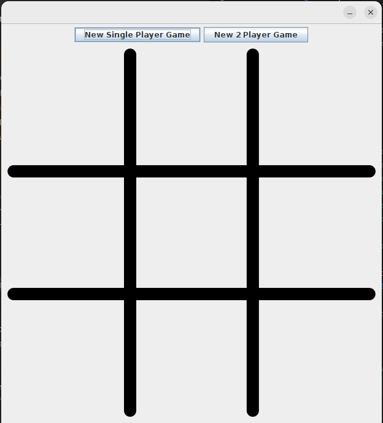
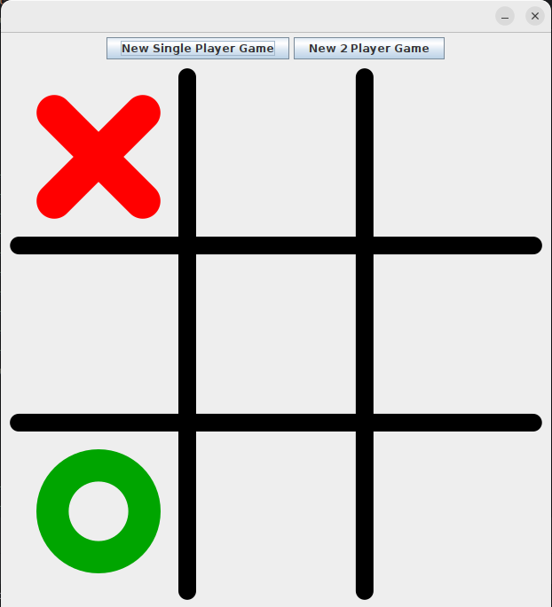
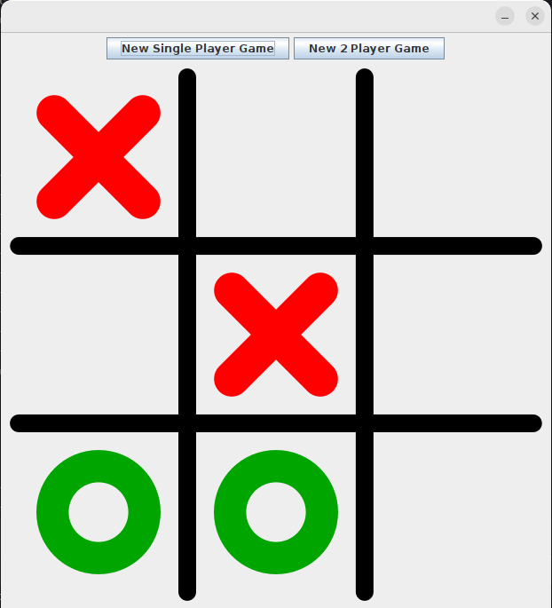
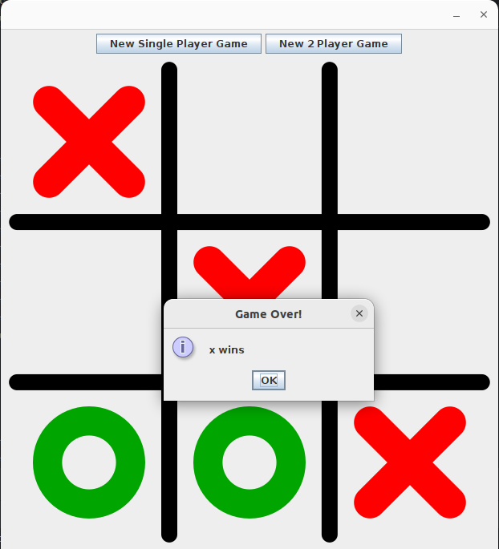
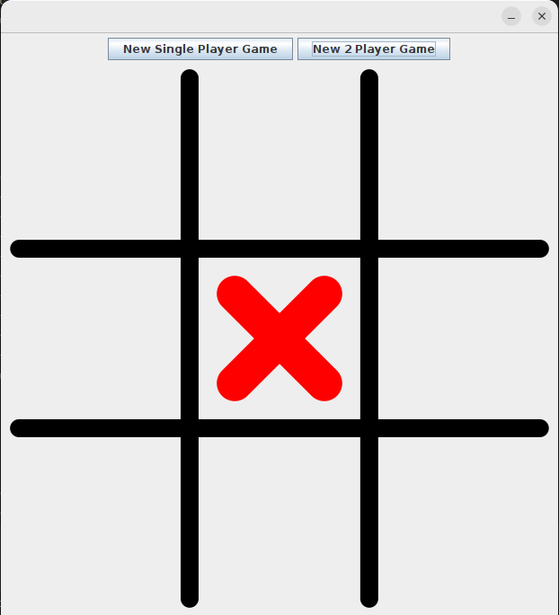
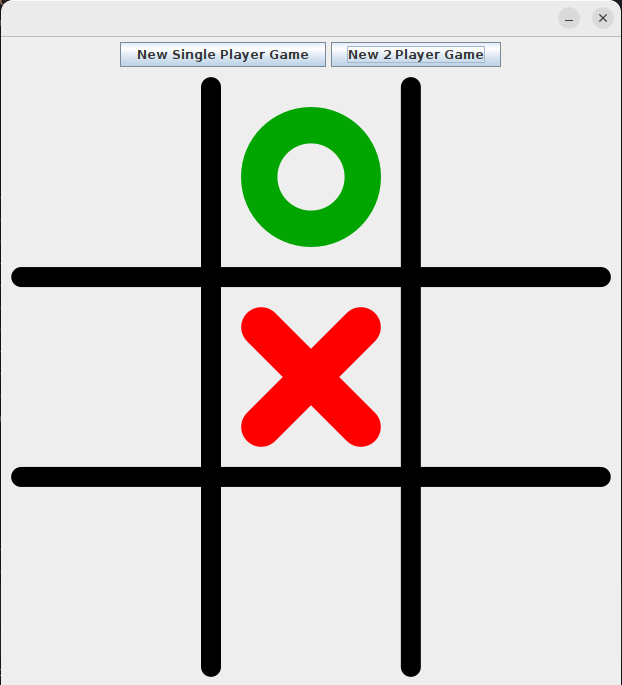
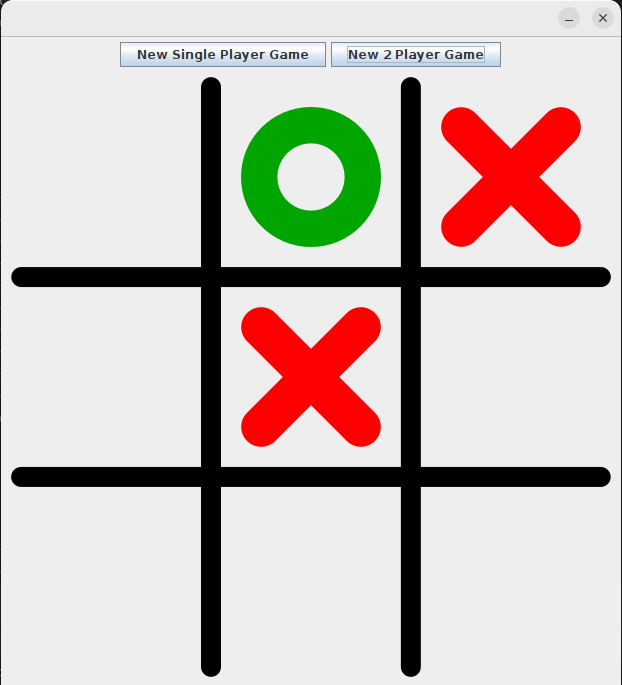
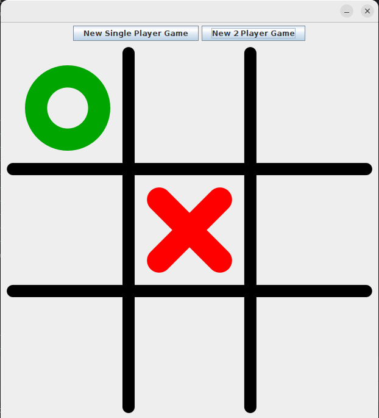
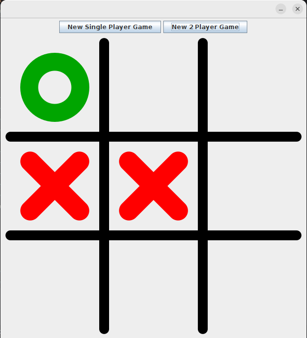
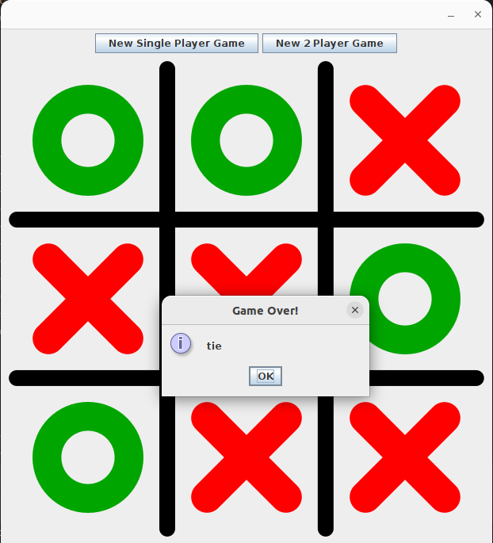

# Tic-Tac-Toe Game

A simple **Tic-Tac-Toe** game built using **Java** and **Swing (Java GUI)**. The game supports both **single-player (AI mode)** and **two-player mode**. It features an interactive UI with smooth gameplay.

## Features
- 🎮 **Single Player Mode**: Play against a simple AI opponent.
- 👥 **Two Player Mode**: Play with a friend.
- 🎨 **Graphical User Interface (GUI)**: Designed using **Java Swing**.
- 🔄 **New Game Option**: Restart the game at any time.
- 🏆 **Win Detection**: The game automatically checks for a winner or a tie.
- ❌ **Invalid Move Handling**: Prevents players from choosing occupied cells.

## Technologies Used
- **Java (JDK 8 or higher)**
- **Swing (Java GUI Framework)**
- **Gradle (Build Tool)**
- **IntelliJ IDEA (Recommended IDE)**

## Project Structure
```
/tic-tac-toe-game
│── src/main/java/com/udacity/
│   ├── Game.java  # Core game logic
│   ├── GameUI.java  # Graphical User Interface
│── resources/
│   ├── grid.png  # Game board image
│   ├── x.png  # 'X' symbol image
│   ├── o.png  # 'O' symbol image
│── README.md  # Project Documentation
│── build.gradle  # Gradle Build Configuration
```

## Setup Instructions
### **Clone the Repository**
```sh
git clone https://github.com/shimla-sinthia/assignment2tictactoe.git
cd assignment2tictactoe
```
### **Run the Game Using Gradle**
```sh
gradle run
```
### **Run the Game Manually**
1. Open the project in **IntelliJ IDEA** (or any Java-supported IDE).
2. Compile and run the `Game.java` file.
3. The Tic-Tac-Toe window will open.

## Gameplay Instructions
1. Select **Single Player** or **Two Player** mode.
2. Click on any empty grid cell to make a move.
3. The game will **automatically switch turns** (or let AI play in single-player mode).
4. The game ends when there is a **winner or a tie**.
5. Click **New Game** to restart!

## 
<table>
  <tr> One player vs Computer</tr>
  <tr>
    <td></td>
    <td></td>
    <td></td>
    <td></td>
  </tr>
  <tr> One player vs Another Player (one wins)</tr>
  <tr>
    <td></td>
    <td></td>
    <td></td>
    <td></td>
  </tr>
  <tr> One player vs Another Player (None wins)</tr>
   <tr>
    <td></td>
    <td></td>
    <td></td>
    <td></td>
  </tr>
</table>

## Future Enhancements
- 🤖 **Improve AI Difficulty** with Minimax Algorithm.
- 🎨 **Add Theme Customization** for board colors.
- 🔊 **Add Sound Effects** for moves and win celebrations.

## License
This project is open-source and available under the MIT License.

